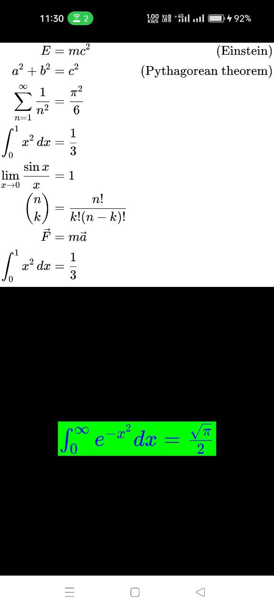
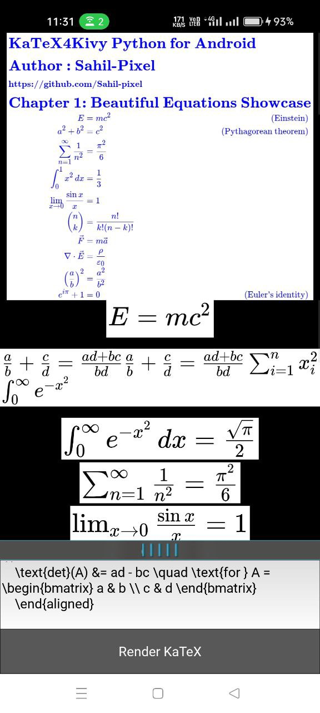

KaTeX4Kivy
==========

Render beautiful LaTeX-style math equations in Kivy using KaTeX on Android.

Module   : KaTeX4Kivy
Author   : Sahil-Pixel
Date     : 30 July 2025
GitHub   : https://github.com/Sahil-pixel/KaTeX4Kivy
KaTeX    : https://katex.org/
Kivy     : https://kivy.org/

------------------------------------------------------------
Overview
------------------------------------------------------------

KaTexImage is a Kivy widget that allows rendering LaTeX math expressions
on Android using KaTeX via a Java WebView backend.

The widget displays the rendered equation (Kivy Image)
without saving any image files to disk — it's fast and entirely in memory.

------------------------------------------------------------
Features
------------------------------------------------------------

- Use KaTeX to render math on Android
- Fully dynamic: supports changing font size, text and background color
- Renders to a texture (not image files)
- Threaded rendering and smooth UI updates
- Works natively in Kivy apps (Android only)

------------------------------------------------------------
Dependencies
------------------------------------------------------------

- Kivy
- Pyjnius
- Java classes:
    - KaTeXRenderer.java
    - BitmapUtil.java
- KaTeX JavaScript and CSS included in the Android WebView

------------------------------------------------------------
How to Use
------------------------------------------------------------
buildozer.spec 
---------
```
# Permissions required
android.permissions = INTERNET

# Java code path (must match folder name exactly)
android.add_src = ./java_code
```
KV Example:
-----------
```kv
KatexImage:
    latex: "E = mc^2"
    font_size: "14px"
    text_color: "#222222"
    background_color: "#FFFFFF"
```
Python Example:
---------------
```python
from katex4kivy import KatexImage

katex = KatexImage(
    latex="E = mc^2",
    font_size="16px",
    text_color="#000000",
    background_color="#FFFFFF"
)
layout.add_widget(katex)
#(Warning! It need some small time 100ms to 200ms to render on android webview)
```
Full Python Example:
---------------
```python
from kivy.app import App
from kivy.uix.boxlayout import BoxLayout
from kivy.utils import platform
from kivy.clock import Clock

if platform == 'android':
    from katex4kivy import KatexImage


class ExampleKaTeX(BoxLayout):
    def __init__(self, **kwargs):
        super().__init__(orientation='vertical', **kwargs)
        if platform == 'android':
            Clock.schedule_once(self.add_katex_widget, 0.2)  # 200ms delay

    def add_katex_widget(self, dt):

        tex1 = r'''
        \begin{aligned}
            E &= mc^2 \quad & \text{(Einstein)} \\
            a^2 + b^2 &= c^2 \quad & \text{(Pythagorean theorem)} \\
            \sum_{n=1}^{\infty} \frac{1}{n^2} &= \frac{\pi^2}{6} \\
            \int_0^1 x^2 \, dx &= \frac{1}{3} \\
            \lim_{x \to 0} \frac{\sin x}{x} &= 1 \\
            \binom{n}{k} &= \frac{n!}{k!(n-k)!} \\
            \vec{F} &= m\vec{a} \\
            \int_0^1 x^2 \, dx &= \frac{1}{3} \\
            \end{aligned} 
              '''
        katex1 = KatexImage(
            latex=tex1,
            font_size="24px",
            text_color="#000000",
            background_color="#FFFFFF"
        )

        self.add_widget(katex1)
        tex2 = "\\int_0^\\infty e^{-x^2} dx = \\frac{\\sqrt{\\pi}}{2}"
        katex2 = KatexImage(
            latex=tex2,
            font_size="24px",
            text_color="#0000FF",
            background_color="#00FF00"
        )
        self.add_widget(katex2)


class HelloKaTeXApp(App):
    def build(self):
        return ExampleKaTeX()


if __name__ == "__main__":
    HelloKaTeXApp().run()

```
------------------------------------------------------------
Widget Properties
------------------------------------------------------------

- latex (str)            : The math expression (KaTeX syntax)
- font_size (str)        : Font size in px (e.g. "12px")
- text_color (str)       : Foreground color as hex (e.g. "#000000")
- background_color (str) : Background color as hex (e.g. "#FFFFFF")

------------------------------------------------------------
Rendering Pipeline
------------------------------------------------------------

1. Python sets or updates properties.
2. Java `KaTeXRenderer` renders the math to an Android Bitmap.
3. `BitmapUtil` converts the Bitmap to a raw RGBA byte array.
4. A background Python thread copies the pixel data.
5. A Kivy Texture is created from the byte array.
6. The texture is displayed in the Image widget.


------------------------------------------------------------
Resource Cleanup
------------------------------------------------------------

To manually dispose Java-side resources:
    katex.release()

Or rely on automatic cleanup in Python's `__del__()`.

------------------------------------------------------------
Java Setup (for Android)
------------------------------------------------------------

Required Java classes (included in your Android project):

- KaTeXRenderer.java
    - Uses WebView to render HTML+KaTeX
- BitmapUtil.java
    - Extracts pixels from Android Bitmap to byte[]

Include KaTeX JS and CSS assets in your Java WebView setup.

------------------------------------------------------------
Repo Structure
------------------------------------------------------------
```
/KaTeX4Kivy/
├── main.py                        # Main Kivy app to display LaTeX using KatexImage
├── katex4kivy.py                  # Defines KatexImage widget (uses katex_render via Pyjnius)
├── backend/
│   └── katex_render.py           # Pyjnius bridge: calls KaTeXRenderer.java from Python
└── java/
    └── org/katex/
        ├── KaTeXRenderer.java    # Java: renders LaTeX to Bitmap via Android WebView
        └── BitmapUtil.java       # Java: converts WebView content to Bitmap
```

## 📷 Screenshot

Here's what the app looks like on Android:
<p align="center">
  
  
  
</p>

[![Watch the video]](https://youtube.com/shorts/dQ-A_xP6iEQ?si=P4ioPWm8_F5-Rjuz)

------------------------------------------------------------
## Pay for Support

If you find this project helpful and want to support development, you can donate for support:

-  [](https://ko-fi.com/sahilpixel)
  
- [](https://paypal.me/SKSAHILIN?country.x=IN&locale.x=en_GB)


Thank you for your support!
---
License
------------------------------------------------------------

MIT License  
Created by Sahil-Pixel  
Free to use in personal and commercial Kivy projects.
